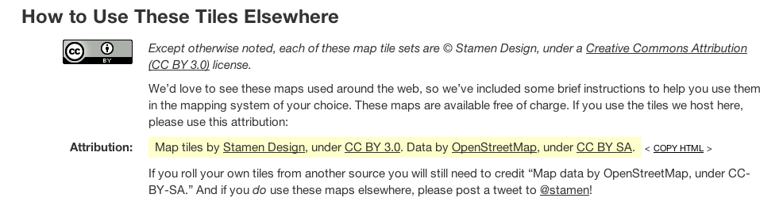

MapStack raster
===============

Chrome extension to raster MapStack maps in the browser giving you the images in milliseconds!

## Credit

Please remember to credit Stamen properly when using the maps from
MapStack:

## How to use

Clone this repo, then go to chrome and go to `chrome://extensions`. Hit
the *Load unpacked extension...* button and then select the
`mapstack-raster` folder. Then when navigating MapStack, use the top right
map icon to generate an image from your current view. All done client
side.

<iframe width="640" height="480" src="//www.youtube.com/embed/CbBqbVInh1k" frameborder="0"></iframe>

## Status

Works with one tile only. Could use a lot of improvements.

## Author

[Nicolas Garcia Belmonte](https://twitter.com/philogb)
